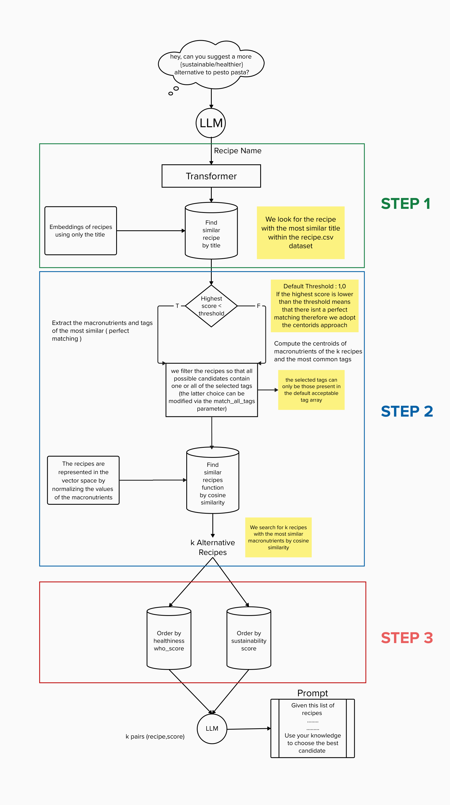
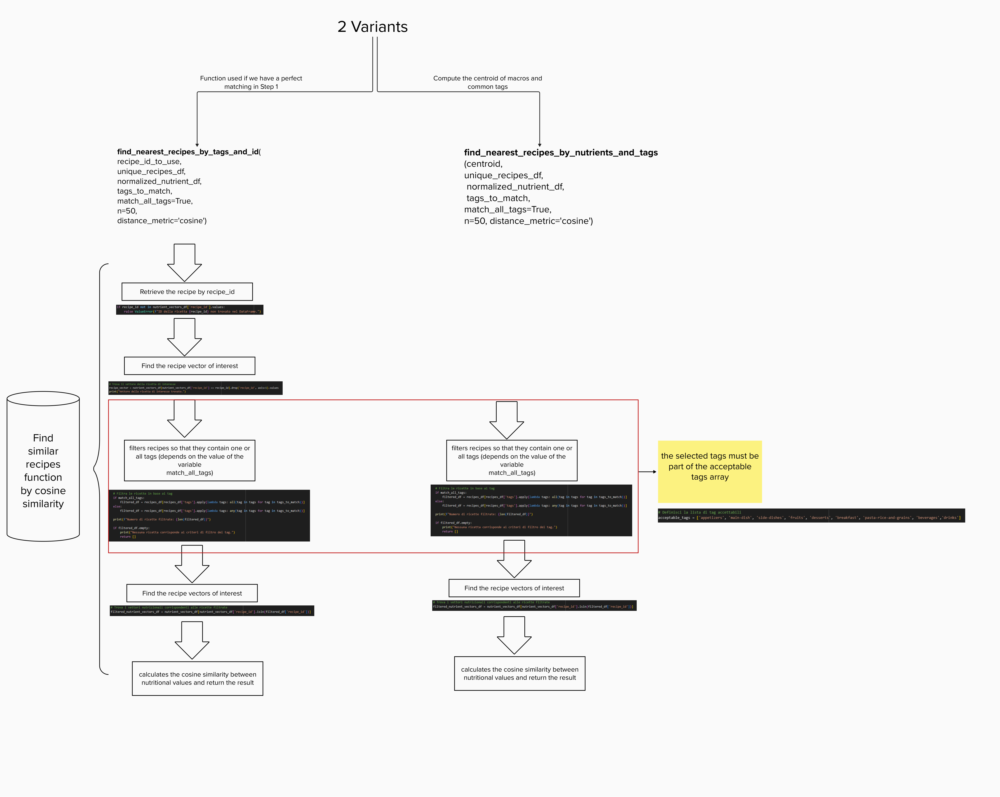

# SustainaMeal

Colab Demo : [](https://colab.research.google.com/path_to_your_notebook)


## Introduction
`SustainaMeal` is a Python library designed to suggest alternative recipes for healthier or more sustainable options. Leveraging machine learning and natural language processing, it compares nutritional profiles and semantic similarities to provide recipe recommendations.

## Architecture
The library consists of several modules:

- **Data Preprocessing**: Remove unnecessary recipe data.
- **Transformer Embeddings**: Generates text embeddings for recipe titles using a transformer model.
- **Nutritional Vector Space**: Maps recipes into a vector space based on nutritional content.
- **Similarity Search**: Executes cosine similarity searches for finding matching recipes.



## Installation
Install `SustainaMeal` using pip:

```bash
pip install git+https://github.com/GiovTemp/SustainaMeal.git
```

## Usage
Initializes the system by loading the data and preparing the embeddings.
```bash
from sustainameal import SustainaMeal

sm = SustainaMeal(
    recipes_df="recipes_df",
    nutrients=['calories', 'fat', 'protein', ...],
    transformer_name='your_transformer_model'
)
```

## Find similar recipes 


Use the find_similar_recipes function to get the alternative recipes.

        :param recipe_df: Datframe containing the recipes.
        :param nutrients: List of nutrient names to use.
        :param transformer_name: Name of the transformer model to use for embeddings. 

Default transformer davanstrien/autotrain-recipes-2451975973

```bash
similar_recipes = sm.find_similar_recipes("Quinoa Salad", k=5)
```

## Order by healthiness score
```bash
score_metric="who_score" #Name of the column of your dataset
# Default value : who_score
healthier_recipes = sm.order_recipe_by_healthiness(score_metric)
```

## Order by sustanability score
```bash
score_metric="sustainability_label" #Name of the column of your dataset
# Default value : sustainability_label
# Avaliable value in provide dataset : sustainability_label , sustainability_score
order_by_sus_recipes = sm.order_recipe_by_sustainability(score_metric)
```

## Display the recommendations
```bash
for recipe in order_by_sus_recipes:
    print(recipe)
```


