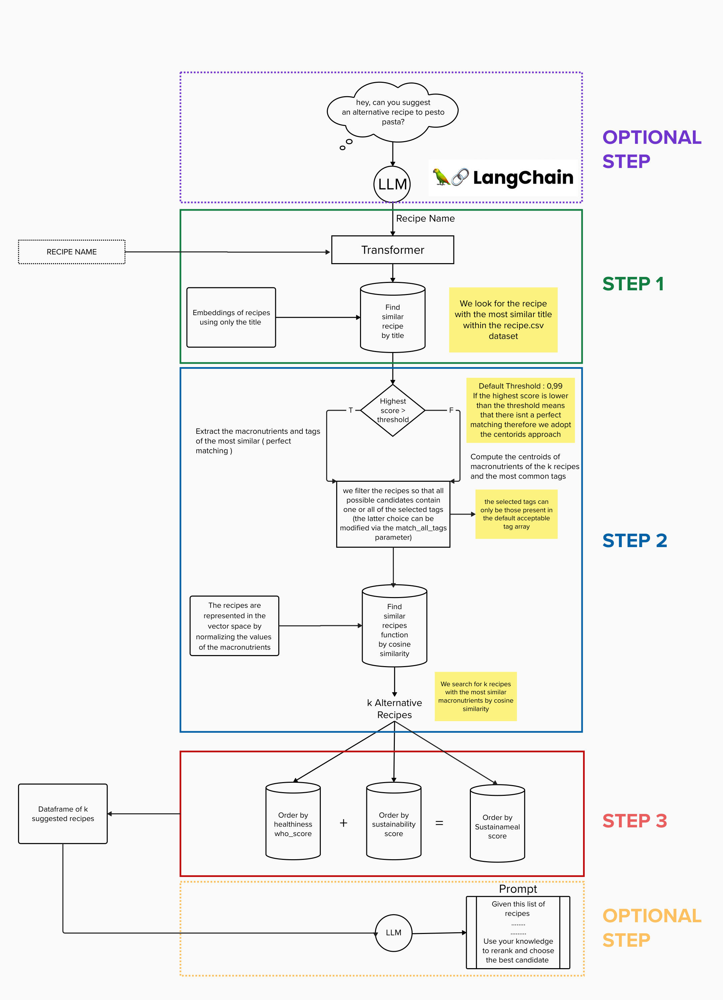

# SustainaMeal

Colab Demo : [](https://colab.research.google.com/drive/1CrBaq3qkM7sMzpeiNR4_92MjUwxM6UQD?usp=sharing)


## Introduction
`SustainaMeal` is a Python library designed to suggest alternative recipes for healthier or more sustainable options. Leveraging machine learning and natural language processing, it compares nutritional profiles and semantic similarities to provide recipe recommendations.

## Architecture
The library consists of several modules:

- **Data Preprocessing**: Remove unnecessary recipe data.
- **Transformer Embeddings**: Generates text embeddings for recipe titles using a transformer model.
- **Nutritional Vector Space**: Maps recipes into a vector space based on nutritional content.
- **Similarity Search**: Executes cosine similarity searches for finding matching recipes.
- **Sort results**: Sorts recipes based on healthiness or sustainability metrics.



## How to use?
### Installation
Install `SustainaMeal` using pip:

```bash
pip install git+https://github.com/GiovTemp/SustainaMeal.git
```

### Initialization
Initializes the system by loading the data and preparing the embeddings.

#### Class Definition :

    def __init__(self, recipes_df, nutrients,
                 transformer_name='davanstrien/autotrain-recipes-2451975973'):
        """
        Initializes the system by loading the data and preparing the embeddings.

        :param recipe_df: Datframe containing the recipes.
        :param nutrients: List of nutrient names to use.
        :param transformer_name: Name of the transformer model to use for embeddings.

        """

#### Usage :


```bash
from sustainameal import SustainaMeal

sm = SustainaMeal(
    recipes_df="recipes_df",
    nutrients=['calories', 'fat', 'protein', ...],
    transformer_name='your_transformer_model'
) 
```

     

Default Transformer used [davanstrien/autotrain-recipes-2451975973](https://huggingface.co/davanstrien/autotrain-recipes-2451975973)
### Find similar recipes 

Use the find_similar_recipes function to get the alternative recipes based on macronutrients similarity based on macronutrients similarity (Step 1 & 2 of the Architecture Diagram) .

#### Function Definition :
    def find_similar_recipes(self, input_text, k, acceptable_tags, match_all_tags,check_sustainability=False):
        """
        Finds recipes similar to the given input text.

        :param input_text: The input text to find similar recipes for.
        :param k: Number of similar recipes to return.
        :param acceptable_tags: List of tags considered acceptable for filtering recipes.
        :param match_all_tags: Matching strategy
        :param check_sustainability: check if the desired recipe is already sustainable
        :param j: number of recipes to consider in the centroid computation 
        :return: A list of tuples with similar recipes and their similarity scores.
        """


#### Usage :

```bash
similar_recipes = sm.find_similar_recipes(
                                          input_text='Creamy Lemon Asparagus Risotto', 
                                          k=10,
                                          acceptable_tags=['appetizers', 'main-dish', 'side-dishes', 'fruits', 'desserts',
                                                            'breakfast', 'pasta-rice-and-grains', 'beverages', 'drinks'],
                                          match_all_tags=True
                                          )
```


### Order by healthiness score

Use the order_recipe_by_healthiness to sort the recipes (Step 3 of the Architecture Diagram) .
#### Function Definition :

    def order_recipe_by_healthiness(self, nearest_recipes=None, score='who_score'):

        """
        Order the recipes obtained previously.

        :param (optional) nearest_recipes: Dataframe to order, if none the dataframe computed by find_similar_recipes will be used.
        :param score: The column name used as the primary sorting criterion.
        :return: A DataFrame of recipes ordered by the specified score.

        """

#### Usage 

- Sorts the DataFrame produced by 'find_similar_recipes', assuming it has been executed before.


```bash
healthier_recipes = sm.order_recipe_by_healthiness(score="who_score")
```

- Sort a different dataframe than the one computed by 'find_similar_recipes' (for example is useful for reordering a subset of the previous dataframe )

```bash
healthier_recipes = sm.order_recipe_by_healthiness(
                                                    nearest_recipes=your_df,
                                                    score="who_score"
                                                  )
```

### Order by sustanability score

Use the order_recipe_by_sustainability to sort the recipes (Step 3 of the Architecture Diagram) .

#### Function Definition :

    def order_recipe_by_sustainability(self, nearest_recipes=None, score='sustainability_label',
                                       secondary_sort_field='who_score'):

        """
        Order the recipes obtained previously.

        :param (optional) nearest_recipes: Dataframe to order , if none the dataframe computed by find_similar_recipes will be used.
        :param score: The column name used as the primary sorting criterion.
        :param secondary_sort_field: The column name used as the secondary sorting criterion.
        :return: A Dataframe with recipes ordered by the given metric.
        """

#### Usage 

- Sorts the DataFrame produced by 'find_similar_recipes', assuming it has been executed before.
```bash
order_by_sus_recipes = sm.order_recipe_by_sustainability(score='sustainability_label')
```

- Sort a different dataframe than the one computed by 'find_similar_recipes' (for example is useful for reordering a subset of the previous dataframe )
```bash
order_by_sus_recipes = sm.order_recipe_by_sustainability(
                                                    nearest_recipes=your_df,
                                                    score="sustainability_label"
                                                  )
```


## Display the recommendations
```bash
for recipe in order_by_sus_recipes:
```

## SustainaMeal Command Line Interface (CLI) Guide

## Overview
The SustainaMeal Command Line Interface (CLI) provides an interface to perform various operations on your SustainaMeal library. Below are the different operations available and how to use them.

## Prerequisites
Make sure you have Python and the required dependencies installed. You can install dependencies by running:

```bash
pip install -r requirements.txt

    print(recipe)
```
## Available Commands
### Load Processed Data
```bash
sustainameal --load
```
This command loads processed data from previously saved files.

### Load Data from CSV
```bash
sustainameal --recipes_csv path/to/your/file.csv
```
This command loads data from a CSV file containing recipes.

### Find Similar Recipes
```bash
sustainameal find_similar RECIPE_NAME --k 5 --acceptable_tags tag1 tag2 --match_all_tags --check_sustainability
```
Find recipes similar to the specified one, with options to limit results based on tags, match all tags, and check sustainability.

### Order by Healthiness
```bash
sustainameal order_by_healthiness RECIPE_NAME --k 5 --acceptable_tags tag1 tag2 --match_all_tags --check_sustainability --score who_score
```
Order recipes by healthiness using a specific score.

### Order by Sustainability
```bash
sustainameal order_by_sustainability RECIPE_NAME --k 5 --acceptable_tags tag1 tag2 --match_all_tags --check_sustainability --score sustainability_score --secondary_sort_field who_score
```
Order recipes by sustainability using a specific primary score and a secondary sort field.

### Order by SustainaMeal Score
```bash
sustainameal order_by_sustainameal RECIPE_NAME --k 5 --acceptable_tags tag1 tag2 --match_all_tags --check_sustainability --alpha 0.7 --beta 0.3
```
Order recipes using the SustainaMeal score with specific weights for sustainability and healthiness.

### Examples

#### Example 1: Load processed data
```bash
sustainameal --load
```

#### Example 2: Find similar recipes
```bash
sustainameal find_similar "Pasta with Tomato" --k 5 --acceptable_tags main-dish --check_sustainability
```

#### Example 3: Order by sustainability
```bash
sustainameal order_by_sustainability "Quinoa Salad" --k 5 --acceptable_tags side-dishes --check_sustainability --score sustainability_score --secondary_sort_field who_score
```
